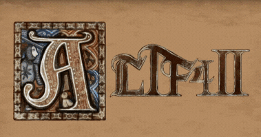
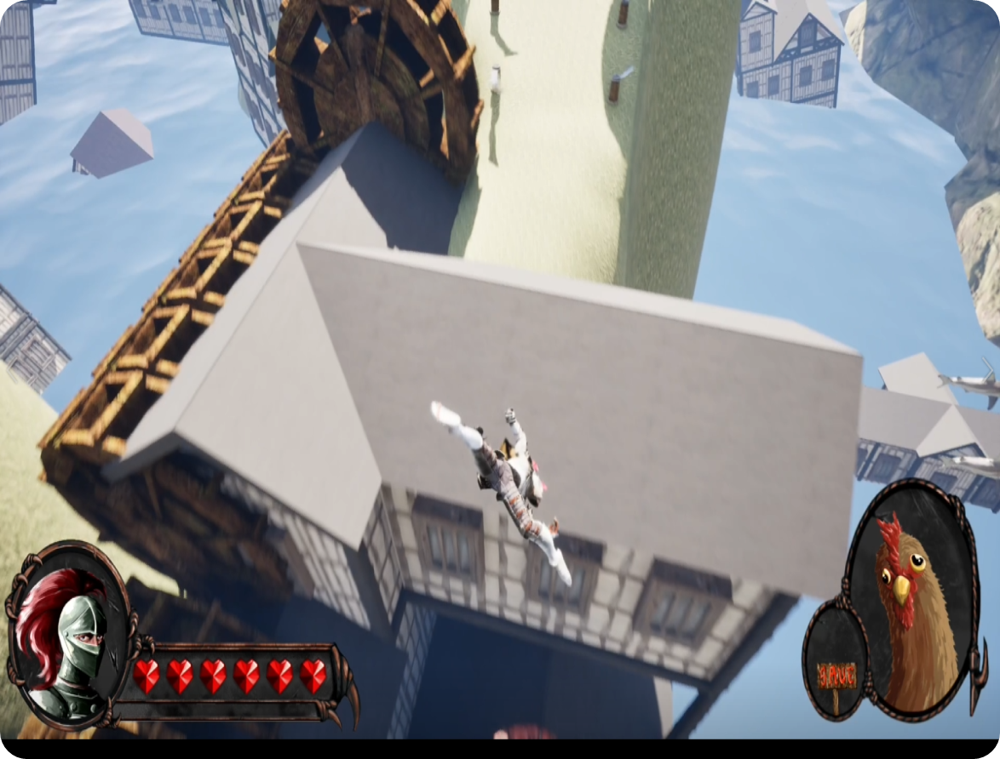

# 🐔 KI_Exam02 — ALTF4

<p align="center">
  
</p>

<p align="center">
  
  
  
  
</p>

---

## 📌 프로젝트 소개

> ALTF4에서 영감을 받은 함정 맵 기반 액션 플랫포머 게임  
> 맵에 가득한 기믹과 함정을 헤쳐나가 최종 목적지에 도달하라!

| 항목 | 내용 |
|:---|:---|
| 🎮 장르 | 액션 어드벤처 / 플랫포머 |
| 🖥️ 플랫폼 | Windows (PC) |
| 👤 개발 인원 | 1인 (개인 프로젝트) |
| 📅 개발 기간 | 2025.10.23 ~ 2025.11.06 |
| ⚙️ 개발 환경 | Unreal Engine 5, Blueprint Only |

---

## 🎬 시연 영상

<p align="center">
  <a href="https://youtu.be/a2J2f-maVHQ?si=1BlEFwaEOwHCCN5R">
    
  </a>
</p>

---

## 🕹️ 조작 방법

| 키 | 동작 |
|:---:|:---|
| <kbd>W</kbd> <kbd>A</kbd> <kbd>S</kbd> <kbd>D</kbd> | 캐릭터 이동 |
| <kbd>Shift</kbd> | 달리기 |
| <kbd>Space</kbd> | 점프 |
| <kbd>R</kbd> | 죽은척하기 (래그돌 상태) |
| <kbd>G</kbd> | 리스폰 |
| `마우스 우클릭` | 에임 모드 전환 |
| `에임 중 마우스 좌클릭` | 닭 발사 (쿨타임 존재) |

---

## ✨ 주요 기능

| 기능 | 설명 | 블루프린트 바로가기 |
|:---|:---|:---:|
| 캐릭터 이동 & 달리기 | 물리 기반 이동 및 속도 전환 | [바로가기](./ALTF4/Content/) |
| 래그돌 시스템 | R키로 즉시 래그돌 상태 전환 | [바로가기](./ALTF4/Content/) |
| 닭 발사 | 에임 모드에서 쿨타임 기반 투사체 발사 | [바로가기](./ALTF4/Content/) |
| 기믹 오브젝트 | 밀려나는 드럼통, 점프대 등 다수 | [바로가기](./ALTF4/Content/) |
| 아이템 시스템 | 클리어를 돕는 여러 아이템 | [바로가기](./ALTF4/Content/) |
| 클리어 판정 | 최종 목적지 도달 시 스테이지 클리어 | [바로가기](./ALTF4/Content/) |
| 사망 처리 | 사망 후 잔여 오브젝트(풍선 등) 정리 | [바로가기](./ALTF4/Content/) |

---

## 🗂️ 프로젝트 구조

```
📁 ALTF4/
 ├── 📁 Content/
 │    ├── 📁 Characters/     # 캐릭터 블루프린트
 │    ├── 📁 Maps/           # 스테이지 맵
 │    ├── 📁 Objects/        # 기믹 오브젝트 (드럼통, 점프대 등)
 │    ├── 📁 Items/          # 아이템
 │    ├── 📁 UI/             # HUD, 메뉴
 │    └── 📁 Assets/         # 에셋 (메시, 텍스처 등)
 └── 📁 Config/              # 프로젝트 설정
```

---

## 📅 개발 일정

| 기간 | 내용 |
|:---|:---|
| 10/23 ~ 10/24 | 에셋 수집 및 폴더 구조 정리, 기본 입력 컨트롤러 구현 |
| 10/26 ~ 10/27 | 물리 이동 & 상호작용 구현 |
| 10/28 ~ 10/29 | 특수 기믹 오브젝트 설계 및 구현 (드럼통, 점프대 등 5~6종) |
| 10/30 ~ 10/31 | 기믹 오브젝트 기반 맵 구현 |
| 11/03 ~ 11/04 | 맵 마무리 및 UI 구현 |
| 11/05 ~ 11/06 | 발표 자료 및 시연 영상 제작, 최종 제출 |

---

## 📦 Release 히스토리

| 버전 | 날짜 | 내용 |
|:---:|:---:|:---|
| v1.3 | 2025.11.07 | 사망 후 잔여 풍선 삭제 로직 핀 연결 수정 (완성도 개선) |
| v1.2 | - | - |
| v1.1 | - | - |
| v1.0 | - | 최초 릴리즈 |

> 📥 [최신 Release 다운로드](../../releases/latest)
